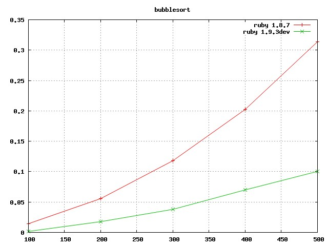
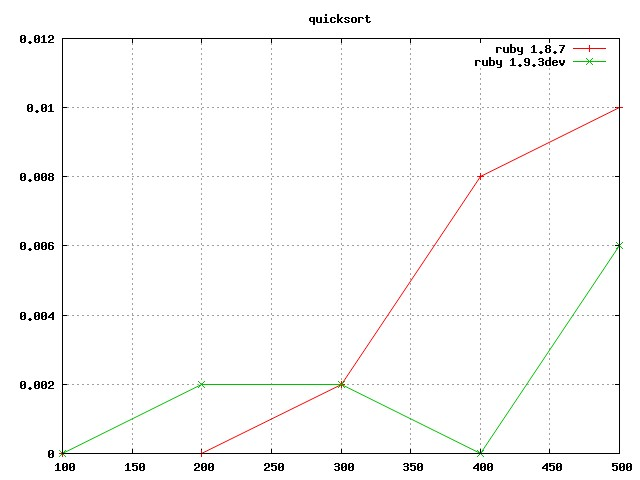

# Viiite &mdash; An alternative to Benchmark

After a first sketch a few weeks ago, I decided to dedicate my *whyday* on Viiite. Viiite is an alternative to Benchmark (stdlib), designed to let benchmarks evolve from simple measures to complete benchmarking infrastructures. This is possible thanks to a separation of concerns between *running* benchmarks (viiite run) and *reporting* benchmarking results (viiite report). 

## Starting 'ala' Benchmark

Let's start with the common Benchmark example and compare the execution times of three iteration methods:

    # bench_iteration.rb
    n = 15000
    Viiite.bench do |r|
      r.report(:for)   { for i in 1..n; a = "1"; end }
      r.report(:times) { n.times do   ; a = "1"; end }
      r.report(:upto)  { 1.upto(n) do ; a = "1"; end }
    end

In such a simple case, the reporting command provides a one-liner for 'running + reporting (with default options)':

    $ viiite report bench_iteration.rb
    +--------+----------+----------+----------+----------+
    | :bench | :user    | :system  | :total   | :real    |
    +--------+----------+----------+----------+----------+
    | :for   | 0.010000 | 0.000000 | 0.010000 | 0.013039 |
    | :times | 0.000000 | 0.000000 | 0.000000 | 0.003753 |
    | :upto  | 0.010000 | 0.000000 | 0.010000 | 0.003803 |
    +--------+----------+----------+----------+----------+

## Going far further...

Why not comparing two sort methods on two different rubies? Here is the benchmark:

<pre><code class="ruby">
# bench_sort.rb
class Array
  def quicksort()  ... end
  def bubblesort() ... end
end

Viiite.bench do |b|

  # variation point on the ruby version
  b.variation_point :ruby, Viiite.which_ruby

  # vary the size of the array to sort (complexity profile)
  b.range_over([100, 200, 300, 400, 500], :size) do |size|
    
    # 5 times for finer-results
    b.range_over(1..5, :i) do

      # run two sort methods on the same benchmark case
      viiite_case = Array.new(size){ rand }
      b.report(:quicksort) { viiite_case.quicksort  }
      b.report(:bubblesort){ viiite_case.bubblesort }

    end
  end
end
</code></pre>

And here is one way to obain a comparison of ruby versions/implementations.

    $ rvm exec viiite run bench_sort.rb | \
      viiite plot -x size -y tms.total --series=ruby --graph=bench --gnuplot

You'll find typical use-cases in the menu at left!
